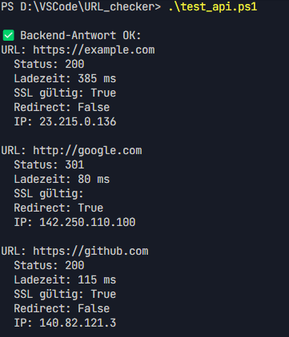
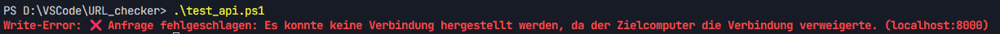

# ReadMe für das Backend 

Dieses Backend ist für die Überprüfung von URLs zuständig. Es bietet eine REST-API, die von einem Frontend oder anderen Clients aufgerufen werden kann, um den Status, die Antwortzeit, SSL-Gültigkeit und weitere Details von gegebenen URLs zu ermitteln.

## Technologien
*  **Node.js**: 18+ (getestet mit Node.js 24)
*  **Express.js**: Für den Webserver und die API-Endpunkte.
*  **Axios**: Für HTTP-Anfragen an externe URLs.
*  **Dotenv**: Zum Laden von Umgebungsvariablen.
*  **CORS**: Für Cross-Origin Resource Sharing.

## Installation
Um das Backend zu installieren, navigierst du in das `backend`-Verzeichnis und installierst die Abhängigkeiten:

```bash
npm install
```

## Ausführung
Das Backend kann auf zwei Arten gestartet werden:

### Im Entwicklungsmodus (Development Mode)
Im Entwicklungsmodus wird `nodemon` verwendet, um den Server bei Dateiänderungen automatisch neu zu starten. Dies ist nützlich während der Entwicklung.

```bash
npm run dev
```
Server läuft mit `nodemon`:


### Produktionsmodus (Production Mode)
Im Produktionsmodus wird der Server direkt mit Node.js gestartet.

```bash
npm start
```
Der Server wird standardmäßig auf Port 8000 gestartet.

## 📦 API-Endpunkte
### 1. URL-Überprüfung (Check URLs)

+ Endpunkt: `/check-urls`

+ Methode: `POST`

+ **Beschreibung:** Überprüft eine Liste von URLs und gibt detaillierte Informationen zurück.


+ Anfrage-Header: `Content-Type: application/json`

+ **Anfrage**-Body (JSON):
```bash
json

{    
    "urls": [
        "https://www.example.com",
        "https://www.another-example.org"
    ]
}
```

+ **Antwort**-Body (JSON):
```bash
json

{
    "count": 2,
    "results": [
        {
            "url": "https://www.example.com",
            "status": 200,
            "responseTime": 123,
            "sslValid": true,
            "redirectedTo": null,
            "ipAddress": "192.0.2.1",
            "headers": { /* ... */ }
        },
        {
            "url": "https://www.another-example.org",
            "status": 404,
            "responseTime": 456,
            "sslValid": false,
            "redirectedTo": null,
            "ipAddress": "198.51.100.1",
            "headers": { /* ... */ }
        }
    ]
}
```


### 2. Gesundheitsprüfung (Health Check)
+ Endpunkt: `/health`

+ Methode: `GET`

+ Beschreibung: Überprüft, ob der Server läuft.

+ Antwort-Body (Text):
```plaintext
OK
```

## Fehlerbehandlung
Das Backend verfügt über eine grundlegende Fehlerbehandlung. Ungültige Anfragen oder Serverfehler werden mit entsprechenden HTTP-Statuscodes und Fehlermeldungen beantwortet.

## CORS
Cross-Origin Resource Sharing (CORS) ist aktiviert, um Anfragen von verschiedenen Ursprüngen zu ermöglichen.


## Testen
### Testen mit PowerShell-Skript
Ein PowerShell-Skript `test_api.ps1` ist im Hauptverzeichnis des Projekts verfügbar, um die `/check-urls`-Funktionalität zu testen. 
Zuerst sicherstellen, dass das Backend läuft, bevor das Skript ausgeführt wird. 
Das Skript führt eine POST-Anfrage an den `/check-urls`-Endpunkt mit einer Liste von URLs und gibt die Antwort aus.

**Eingabe:**

```powerShell
# Testen der /check-urls-Funktionalität
cd url-checker/backend
./test_api.ps1
```


**Die Ausgabe sollte in etwa so aussehen:**



***Wenn das Script ohne laufenden Server ausgeführt wird, wird eine Fehlermeldung angezeigt:***

